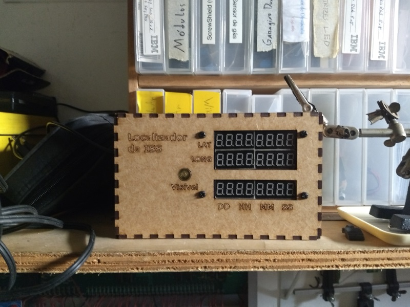

# LocalizadorISS
Placar indicando a posição atual da ISS

Documentação:
https://garoa.net.br/wiki/Localizador_ISS

Pastas neste repositório:

* Caixa: projeto para cortar a caixa na Lase Cutter
* Hardware: esquema do hardware
* ISSAPI: programa Python que implementa a API que fornece as informações
* LocISS: programa Arduino que pega as informações e a apresentam

Vídeo demonstrando e explicando:

https://www.youtube.com/watch?v=tiLaONO_Hk8
